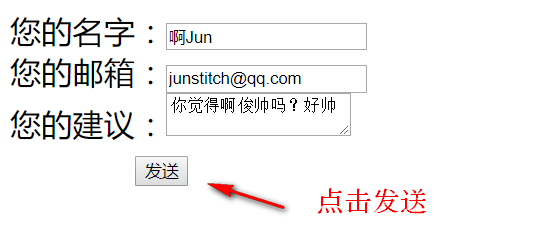

# 163PHPMailer
基于163邮箱的授权密码（独立密码）的phpmailer简易使用

#
1、首先要设置php-ini(开启选项：extension=php_openssl.dll)默认是关闭的，开启以后，需要重新启动服务器。
#

2、然后申请163邮箱的第三方授权密码，注意，163邮箱的授权密码和QQ邮箱的授权密码不太一样；163邮箱只有一个授权密码，但不固定时间；而QQ邮箱则可以有多个，但是好像都有固定时间
#

3、在PHPMailer中 $mail->Username 填上您的163邮箱； $mail->Password 填上您的授权密码。
#

4、注意：$mail->From = 也是填上上面的邮箱，$mail->Username可以不加上邮箱域名,但是$mail->From必须加上邮箱域名（@163.com）。
#

5、$mail->addAddress 可使用多个，因此可以群发邮箱。
#

#

